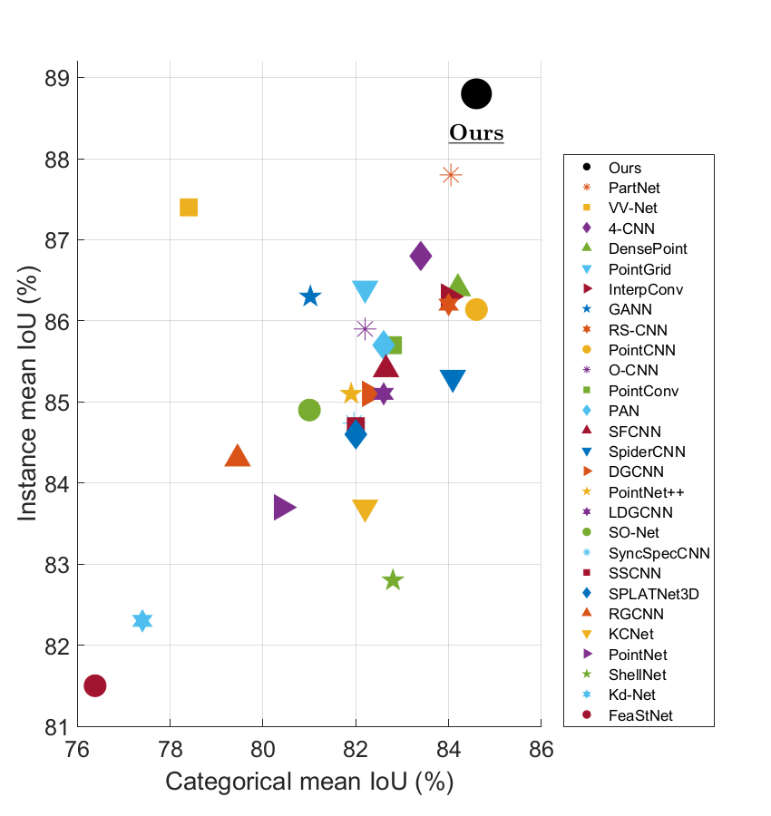

# Learning to Segment 3D Point Clouds in 2D Image Space

## Overview
In contrast to the literature where local patterns in 3D point clouds are captured by customized convolutional operators, in this paper we study the problem of how to effectively and efficiently project such point clouds into a 2D image space so that traditional 2D convolutional neural networks (CNNs) such as U-Net can be applied for segmentation. To this end, we are motivated by graph drawing and reformulate it as an integer programming problem to learn the topology-preserving graph-to-grid mapping for each individual point cloud. To accelerate the computation in practice, we further propose a novel hierarchical approximate algorithm. With the help of the Delaunay triangulation for graph construction from point clouds and a multi-scale U-Net for segmentation, we manage to demonstrate the state-of-the-art performance on ShapeNet and PartNet, respectively, with significant improvement over the literature.



##

## Conda environment setup
```
conda create -n XYZNet
conda activate XYZNet
conda install python=3.7 tensorflow-gpu=2.2.0 scikit-learn scipy networkx keras
```

## Download the ShapeNet part dataset
```
sh download_data.sh
```

## Prepare training and testing dataset
```
python data_preparation_training.py
python data_preparation_testing.py
```

## Training choice 1: Training using pre-stored dataset
Training the network using pre-stored dataset is a relatively faster and more robust way to train the network.
However, it will allocate many disk space ( ~3TB in default setting). Our reproduced model is training using this approach.
The steps are as follows:

### 1. Prepare the dataset
This step is to project all point cloud samples to 2D image representations in advance and store them locally.
```
python prepro_dataset.py
```

### 2. Train the network
```
python prepro_training.py
```

### 3. Demo model
An official reproduced model is available for demonstration purposes. The model is trained on ShapeNet dataset using training choice 1 with the following settings:
NUM_REPEATS = 11, 
NUM_CUTS = 32, 
SIZE_SUB = 12, 
SIZE_TOP = 12, 
FLAG_ROTATION = 1, 
FLAG_JITTER = 1, 
epochs = 30. 
Other training settings are as default. 
The training time is as follows: data_preparation: 25 hr, training: 120 hr. 
The demo model achieved 90.1% accuracy, 85.6% instance-mean-IoU and 83.1% class-mean-IoU on the test set.
The model is available at https://drive.google.com/file/d/1lDg8B6AHe7BmgI7dfz5mRGIK24F7Eg28/view?usp=sharing.
Traning log is available at https://drive.google.com/file/d/1TBnksOJjEhWJuIQD-tbQUb_fichDKqri/view?usp=sharing.

## Training choice 2: Training end-to-end
Training the network end-to-end is space efficient.
In theory, it can train the network with unlimited data augmentations and get well trained models;
however, according to the feedback, it may not very stable.
The steps are as follows:

### 1. Train the network
```
python network_training.py
```

### 2. Demo model
An official reproduced model is available for demonstration purposes. The model is trained on ShapeNet dataset using training choice 2 with the following settings:
NUM_CUTS = 32, 
SIZE_SUB = 16, 
SIZE_TOP = 16, 
FLAG_ROTATION = 1, 
FLAG_JITTER = 1, 
epochs = 100. 
Other training settings are as default. 
The training time is as follows: training: 200 hr.
The demo model achieved 89.0% accuracy, 84.1% instance-mean-IoU and 81.2% class-mean-IoU on the test set.
The model is available at https://drive.google.com/file/d/1Ps1wZ79aMjk1XHtYkXiaP6Sp09ExImN9/view?usp=sharing.
Traning log is available at https://drive.google.com/file/d/1TBnksOJjEhWJuIQD-tbQUb_fichDKqri/view?usp=sharing.

## Test the network
After training, we have got a well trained network models. To predict the semantic labels and evaluate on testing sets, run the following command:
```
python network_testing.py
```
## Citation
```
@inproceedings{lyu2020learning,
  title={Learning to Segment 3D Point Clouds in 2D Image Space},
  author={Lyu, Yecheng and Huang, Xinming and Zhang, Ziming},
  booktitle={Proceedings of the IEEE/CVF Conference on Computer Vision and Pattern Recognition},
  pages={12255--12264},
  year={2020}
}
```
